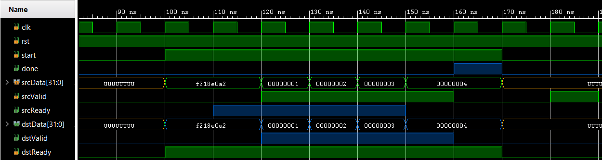

# VHDL neural network accelerators for distributed computation on FPGAs

VHDL implementation of job parser and hardware accelerator modules.
It uses a modified version of a [UDP echo server](https://forum.digilentinc.com/topic/3968-ethernet-udp-echo-server/) to send and recieve jobs from [this library](https://github.com/jm-hsn/tf-fpga).

Each job is contained in a 32-bit data stream and comprised of
- preamble
- moduleId
- jobId
- payload[]
- checksum

where the payload is of arbitrary length, set by each module individually.

Jobs will be transmitted independant of UDP constraints. So they can be split and concatenated at any 32-bit offset.

## Configuring the FPGA cluster

the Nexys 4 DDR development board has an array of switches and LEDs connected to an Artix 7 FPGA. Therefore the rightmost 5 switches will be used to set the IP address (LSB 0-4) of the board.
```
all off: 192.168.1.32
...
all on:  192.168.1.63
```

## Adding a compute module

Each module has it's own module ID. They can be set in `src\hdl\globals.vhd`:
```vhdl
constant moduleCount : integer := 5;
constant moduleIds : register_file(0 to moduleCount-1) :=(
   0 => x"2cb31e7c", --dummyBig
   1 => x"f218e0a2", --dummy
   2 => x"9323eb24", --f11
   3 => x"4cd2e19c", --conv2d_5x5
   4 => x"12345678"  --myNewModule
);
```

Create a new vhd source file for the entity of the module.
The interface of a module has to include these signals:
```vhdl
entity myNewModule is
   generic (
      busWidth : integer:=32
   );
   Port ( 
      clk      : in  std_logic;
      rst      : in  std_logic;
      start    : in  std_logic;
      done     : out std_logic;
      
      srcData  : in  std_logic_vector (busWidth-1 downto 0);
      srcValid : in  std_logic;
      srcReady : out std_logic;
      
      dstData  : out std_logic_vector (busWidth-1 downto 0);
      dstValid : out std_logic;
      dstReady : in  std_logic
   );
end myNewModule;
```

and should be connected to `src\hdl\multiplex.vhd` as follows:

```vhdl
myNewModule_0 : myNewModule 
   generic map (
      busWidth => busWidth
   ) port map (
      clk      => clk,
      rst      => rst,
      start    => muxStart(4),
      done     => muxDone(4),
      
      srcData  => muxSrcData,
      srcValid => muxSrcValid,
      srcReady => muxSrcReady(4),
      
      dstData  => muxDstData(4),
      dstValid => muxDstValid(4),
      dstReady => muxDstReady
   );
```

The timing of the output signals (tinted in blue) should be the following:



- reset is active low
- begin working when start is high
- toggle done for 1 cycle only after sending last word
- data is received only if srcReady was high 1 cycle before
- data can only be sent if dstReady was high 1 cycle before

## Source structure

```tree
├───bd
│   └───design_1
├───constraints
├───hdl
├───ip_repo
│   ├───7segment
│   │   ├───src
│   │   └───xgui
│   ├───UDP-server
│   │   ├───src
│   │   └───xgui
│   └───UDP_echo-server
│       ├───src
│       └───xgui
└───testbench
```

<object data="design_1.pdf" type="application/pdf" width="700px" height="700px">
    <embed src="design_1.pdf">
        <p>This browser does not support PDFs. Please download the PDF to view it: <a href="design_1.pdf">Download PDF</a>.</p>
    </embed>
</object>

---

## How to prepare Vivado for Git support

Add the `scripts` directory and the file `Vivado_init.tcl` (or append the relevant lines if you already have
something in it) to:

- `%APPDATA%\Roaming\Xilinx\Vivado` on Windows
- `~/.Xilinx/Vivado` on Linux

## How to pull newest version and create project from sources

- delete local changes `git pull && git reset --hard`
- start Vivado in any directory
- `Tools` > `Run Tcl Script...` > `vhdl-modules.tcl`

Vivado should then recreate the project inside `vivado_project/` and open it.

When `design_1_wrapper` doesn't appear as Top Module:

- Watch the Tcl Console for any possible errors during creation, mainly missing files.
- Try running Vivado 2018.3
- create a Git issue with your Tcl output attached
- recreate without `vhdl-modules.tcl`

## How to recreate project without `vhdl-modules.tcl`

1. create empty directory `<cloned repo>/vivado_project/`
2. Create project `vhdl-modules` inside that directory with *own project folder* unchecked ☐
3. Import all sources from `src/hdl/` with *copy sources into project* checked ☑
4. Import block design `src/bd/design_1/design_1.bd` with *copy sources into project* checked ☑
5. Import block design `src/bd/tb_design_1/tb_design_1.bd` with *copy sources into project* checked ☑
6. Import configured ip from `src/ip/` with *copy sources into project* unchecked ☐
7. Import testbenches from `src/testbench/` with *copy sources into project* unchecked ☐
8. Import constraints from `src/constraints/` with *copy sources into project* unchecked ☐
9. `design_1` > `create HDL Wrapper...` > Let Vivado manage wrapper
10. make sure `design_1_wrapper` is the Top Module for synthesis
11. `tb_design_1` > `create HDL Wrapper...` > Let Vivado manage wrapper
12. make sure `tb_module` is the Top Module for simulation

The project is now ready to be synthesized.

## How to commit changes

type **inside Vivados Tcl console**:

```tcl
git add .
git commit -m "my commit"
```

This way `vhdl-modules.tcl` will by overridden.

## Simulation

The top level entity for the simulation is `tb_module`.
It requires some input data to be able to simulate the FIFOs and the packaging module.
It has to be supplied in the following files:
- `vivado_project/vhdl-modules.sim/sim_1/behav/xsim/input.txt`

   ```
   315 ns 11100001111001001100001100010010   # preamble = 0xe1e4c312
   315 ns 00010010001101000101011001111000   # moduleId = 0xf218e0a2 (dummy module)
   315 ns 11110010000110001110000010100010   # jobId    = 0x12345678
   315 ns 00000000000000000000000000000001   # data[0]  = 0x00000001
   315 ns 00000000000000000000000000000010   # data[1]  = 0x00000002
   315 ns 00000000000000000000000000000011   # data[2]  = 0x00000003
   315 ns 00000000000000000000000000000100   # data[3]  = 0x00000004
   315 ns 11111011101100101100100011011100   # checksum = 2**32 - (moduleId+jobId+data) % (2**32)
   ```
  where 315 ns (31.5 cycles) is the set minimum time between writes to the input FIFO, followed by the input data signals 31 downto 0.

- `vivado_project/vhdl-modules.sim/sim_1/behav/xsim/outputTimings.txt`

   ```
   15 ns
   15 ns
   15 ns
   15 ns
   15 ns
   15 ns
   15 ns
   15 ns
   ```
   where 15 ns (1.5 cycles) is the set minimum time between read operations from the output FIFO.

These files can be created by running one of these commands:
- `python3 tests/dummyBin.py`
- `python3 tests/dummyBigBin.py`
- `python3 tests/ImgToConv2dBin.py`

After running the simulation the following file will be created:
- `vivado_project/vhdl-modules.sim/sim_1/behav/xsim/output.txt`
   ```
   860000 ps 11100001111001001100001100010010
   880000 ps 00010010001101000101011001111000
   900000 ps 11110010000110001110000010100010
   1170000 ps 00000000000000000000000000000001
   1490000 ps 00000000000000000000000000000010
   1810000 ps 00000000000000000000000000000011
   2130000 ps 00000000000000000000000000000100
   2470000 ps 11111011101100101100100011011100
   ```
   where a line contains the elapsed time since simulation start, followed by the data of the output FIFO.

The result of a convolution (`ImgToConv2dBin.py`) can be parsed as image by running
`python3 tests/ioImg.py`

---

## Readme of [barbedo/vivado-git](https://github.com/barbedo/vivado-git)

Trying to make Vivado more git-friendly.

### Requirements

- Tested on Vivado 2019.2

#### Windows

- [Git for Windows](https://git-scm.com/download/win)
- Add `C:\Program Files\Git\bin` (or wherever you have your `git.exe`) to your `PATH`

#### Linux

- Git

### Installation

Add the `scripts` directory and `Vivado_init.tcl` (or append the relevant lines if you already have
something in it) to:

- `%APPDATA%\Xilinx\Vivado` on Windows
- `~/.Xilinx/Vivado` on Linux

### How it works

Vivado is a pain in the ass to source control decently, so these scripts provide:

- A modified `write_project_tcl_git.tcl` script to generate the project script
  without absolute paths.

- A git wrapper that will recreate the project script and add it before committing.

- A Tcl script (`wproj`) to just create the Tcl project generator script without
  using git. This script can be called from the Tcl Console on Vivado.

### Workflow

 1. When first starting a project, create it in a folder called `vivado_project`
    (e.g. `PROJECT_NAME/vivado_project`). All the untracked files will be under this directory.

 2. Place your source files anywhere you want in your project folder
    (e.g. `PROJECT_NAME/src`).

    Here is an example of a possible project structure:

    ```tree
    PROJECT_NAME
        ├── .git
        ├── .gitignore
        ├── project_name.tcl         # Project generator script
        ├── src/                     # Tracked source files
        │   ├── design
        │   │    ├── *.v
        │   │    └── *.vhd
        │   ├── testbench
        │   │    ├── *.v
        │   │    └── *.vhd
        │   └── ...
        └── vivado_project/          # Untracked generated files
            ├── project_name.xpr
            ├── project_name.cache/
            ├── project_name.hw/
            ├── project_name.sim/
            ├── project_name.srcs/
            │    ├── sources_1/
            │    │    ├── bd/                                  # BDs are regenerated from script
            │    │    │    ├── my_bd/hdl/my_bd_wrapper.{v,vhd} # BD wrappers are also regenerated
            │    │    │    └── ...
            │    │    └── ...
            │    └── ...
            └── ...
    ```

 3. Initialize the git repository with `git init` on the Tcl Console. This will
    create the repository, automatically change to your project directory
    (`PROJECT_NAME`), generate the `.gitignore` file and stage it.

 4. Stage your source files with `git add`.

 5. When you are done, `git commit` your project. A `PROJECT_NAME.tcl`
    script will be created in your `PROJECT_NAME` folder and added to your commit.

 6. Afterwards, when opening the project after cloning it, do it by using
    `Tools -> Run Tcl Script...` and selecting the `PROJECT_NAME.tcl` file
    created earlier. This will regenerate the project so that you can continue to work.

### Notes

### Block design support

If a block design is present, Tcl processes will be integrated in the project
generator file to regenerate it.

The script will also automatically create and add the BD wrapper to the project.

The wrapper of the `.bd` file **must** be called `${bd_name}_wrapper`
(e.g. `my_awesome_bd_wrapper` if your BD is called `my_awesome_bd`),
which is the default when creating in the GUI with `Create HDL Wrapper...`.

The BD wrapper that is automatically generated by Vivado **must not** be
tracked by Git. If you need to manually modify the BD wrapper generated by Vivado,
you can write a handwritten wrapper to the generated wrapper and put only the
handwritten one under source control.

#### Board part and IP repositories paths

Only board part and IP repositories inside the project are stored in the project
generator script.

If you have a system wide board part or IP repository, you will need to add it manually
after recreating the project from the Tcl script (e.g. via `Settings --> Board Repository`).
